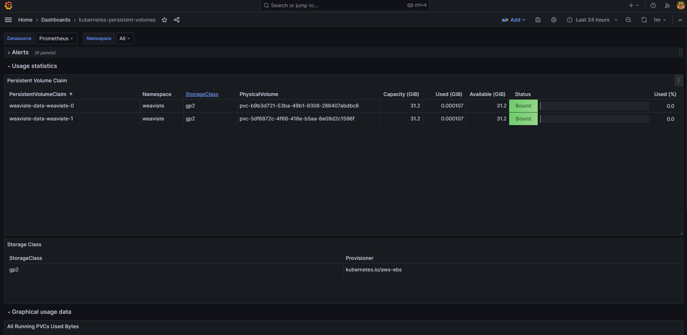
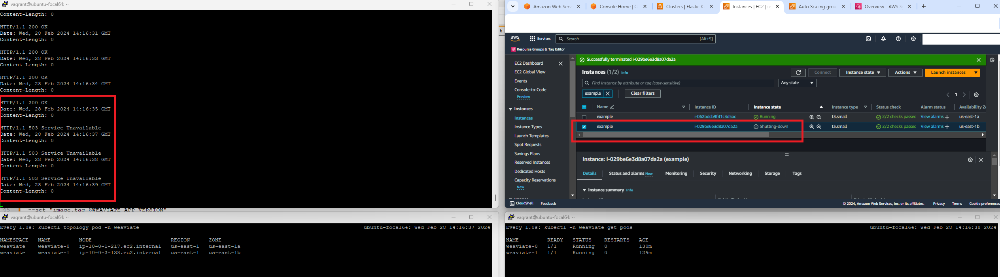
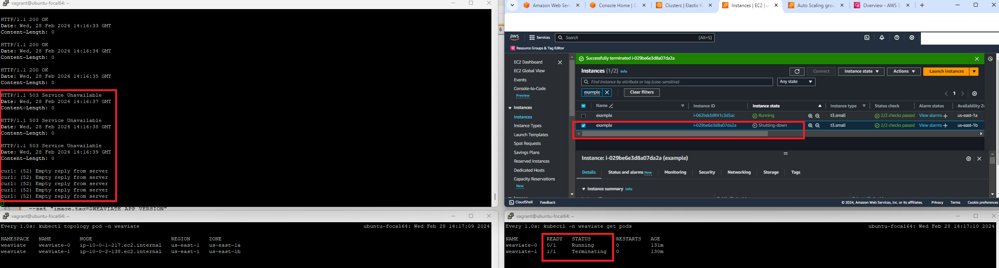

# Part 1 - Terraform Code Review
**Dive into the provided 'Terraform SRE Exercise' code. Your mission is to spot potential issues and suggest enhancements**

The solution proposed is a Github actions CICD pipeline that does the following:
- With Terraform, it deploys an AWS VPC with private and public subnets in two different AZs
- With Terraform, it deploys an AWS EKS cluster in the private subnets of that VPC, installing some basic add-ons kubernetes components inside EKS, like coredns, kube-proxy, ebs_csi_driver and vpc-cni
- With Helm, it deploys Weaviate with the default settings coming from the default values.yaml
- With Helm, it deploys Prometheus and Grafana for monitoring
- It finally runs a basic test to verify the infra and application are working

The workflow  `develop-deploy.yml` is automatically run when a pull request is merged into the `develop` branch (it can also be run manually in the github console). This automatically deploys the solution into a `develop` environment.

When a `release branch` is created, the workflow `staging-deploy.yml` is automatically triggered, and the solution is deployed into an `staging` environment.

Finally, when a pull request is merged into the `main` branch, the workflow `prod-deploy.yml` is automatically triggered into the `prod` environment.

The CICD pipeline needs further improvements, like when to create the release branch, when to create a tag, among other things.

Proceed with the following steps if you want to deploy the solution in your AWS Account:

## Prerequisites

* AWS Account
* IAM user with admin permissions, which will be used by the Github actions runner
* (optional) IAM user with EKS admin permissions to be the Kubernetes administrator (to be configured in infra.tfvars)
* Git 

## Steps

* Git clone the repo:
```
git clone https://github.com/luisllm/weaviate-challenge.git
```

* Git clone the repo with the configurations of the environments\
```
git clone https://github.com/luisllm/environments.git
```

You can use this same config repo, or clone it and use yours to make your own changes.\
If you use your own config repo, you need to adapt the `repository` in the Github workflow files: `develop-deploy.yml`, `staging-deploy.yml` and `prod-deploy.yml`\
Example:
  ```
        - name: Fetch variable file infra.tfvars from CONFIG REPO
        uses: actions/checkout@v2
        with:
          repository: "luisllm/environments"
          ref: develop # or specify the branch, tag, or commit hash where the file resides
          path: "./environments"
  ```

This config repo has 3 branches, one per environment, and holds the `infra.tfvars` with the input variables for Terraform, as well as a customized `values.yaml` for the Weaviate deployment with Helm. The structure is the following:


* In the github console for your repo, create the secrets `AWS_ACCESS_KEY_ID` and `AWS_SECRET_ACCESS_KEY` with the credentials of your AWS IAM admin user\
Improvement: use a self hosted github actions runner, and use an AWS IAM Role instead of the AWS credentials


* Create 3 AWS S3 buckets for the Terraform tfstates, one per environment:
1. `develop-<your_s3_bucket_name>`
2. `staging-<your_s3_bucket_name>`
3. `prod-<your_s3_bucket_name>`
   
* In the github workflow files `develop-deploy.yml`, `staging-deploy.yml` and `prod-deploy.yml`, modify the following variable according to the S3 bucket names that you have previously created: S3_BUCKET_TF_STATE

* The platform is by default deployed in region `us-east-1`. If you wish to change the region for your deployments:
  - In the config repo, modify the `aws_region` variable in `infra.tfvars` for the 3 environments (the 3 branches)
  - In the workflow files `develop-deploy.yml`, `staging-deploy.yml` and `prod-deploy.yml`, replace `us-east-1` for the region of your choice

* Before running the workflow, double-check the `infra.tfvars` file of the config repo for the environment branch that you are going to deploy, adapting any variables if needed

* Manually run the worflow `develop-deploy.yml` to deploy the platform in the `develop` environment.
This workflow is also automatically run when merging a pull request into the `develop` branch


* Double-check all steps of the workflow have finished successfully.


* Double-check in the the AWS console all the infra created: VPC, private and public subnets, NATGW, EKS cluster, LoadBalancer, Security Groups, etc
  
* Connect to the EKS cluster to check everything is working as expected.\
For this you need to have awscli and kubectl installed in your laptop or personal VM where you are running these commands from

```
AWS_PROFILE=<your_aws_profile> aws eks update-kubeconfig --name develop-eks-cluster --region <your_aws_region>
```

```
  $ kubectl get pods -A
NAMESPACE     NAME                                                    READY   STATUS    RESTARTS   AGE
kube-system   aws-node-nzrz2                                          2/2     Running   0          55m
kube-system   aws-node-ptnmq                                          2/2     Running   0          55m
kube-system   coredns-6b8b7ff8d6-m2nwb                                1/1     Running   0          55m
kube-system   coredns-6b8b7ff8d6-x9rmj                                1/1     Running   0          55m
kube-system   ebs-csi-controller-86957b8c-jgdwg                       6/6     Running   0          55m
kube-system   ebs-csi-controller-86957b8c-schfn                       6/6     Running   0          55m
kube-system   ebs-csi-node-7n9hr                                      3/3     Running   0          55m
kube-system   ebs-csi-node-l4f8m                                      3/3     Running   0          55m
kube-system   kube-proxy-d5lpl                                        1/1     Running   0          55m
kube-system   kube-proxy-lbr2n                                        1/1     Running   0          55m
monitoring    alertmanager-mon-kube-prometheus-stack-alertmanager-0   2/2     Running   0          3m56s
monitoring    mon-grafana-d7747b6b7-tb9br                             3/3     Running   0          3m59s
monitoring    mon-kube-prometheus-stack-operator-74f8f899c9-vvv7g     1/1     Running   0          3m59s
monitoring    mon-kube-state-metrics-64bc6679-b4656                   1/1     Running   0          3m59s
monitoring    mon-prometheus-node-exporter-czgdb                      1/1     Running   0          3m59s
monitoring    mon-prometheus-node-exporter-vfmb4                      1/1     Running   0          3m59s
monitoring    prometheus-mon-kube-prometheus-stack-prometheus-0       2/2     Running   0          3m56s
weaviate      weaviate-0                                              1/1     Running   0          3m18s
weaviate      weaviate-1                                              1/1     Running   0          3m5s
```

```
$ kubectl -n weaviate get all
NAME             READY   STATUS    RESTARTS   AGE
pod/weaviate-0   1/1     Running   0          4m12s
pod/weaviate-1   1/1     Running   0          3m59s

NAME                        TYPE           CLUSTER-IP       EXTERNAL-IP                                                              PORT(S)        AGE
service/weaviate            LoadBalancer   172.20.169.175   a048fa2986b6d40c39eda715d833d4e1-668984399.us-east-1.elb.amazonaws.com   80:32398/TCP   4m13s
service/weaviate-headless   ClusterIP      None             <none>                                                                   80/TCP         4m13s

NAME                        READY   AGE
statefulset.apps/weaviate   2/2     4m13s
```

* If all the steps of the `develop-deploy.yml` workflow finished successfully, you can create a release branch based on the `develop` branch.\
This will automatically trigger the `staging-deploy.yml` workflow, and will automatically deploy the solution in a `staging` environment.
  
```
# git branch
* develop
  main
# git checkout -b release/1.0.0
# git push --set-upstream origin release/1.0.0
```


* If all the steps of the `staging-deploy.yml` workflow finished successfully, you can create a pull request and merge it into the `main` branch.\
This will automatically run the `prod-deploy.yml` workflow, which will deploy the solution in the `prod` environment.\
For the prod workflow, a github issue is automatically created to force a manual check of the Terraform plan in production, before Terraform apply is executed in prod.


Double-check the Terraform plan output


You need to answer to the github issue with "approved" or "denied" . If approved, the workflow will continue with the Terraform apply


When everything is deployed successfully, you will have 3 different VPCs and EKS clusters:


## Improvements identified
- Use AWS DynamoDB to lock the Terraform state to prevent parallel executions
- Self hosted Github actions runner, so that we don't need to use the AWS IAM user credentials and also we don't need to open the EKS cluster public endpoint to everywhere
- Deploy aws-load-balancer-controller inside the EKS cluster to create either an AWS NLB or ALB
- Use different AWS Accounts per environment
- CICD: prepare official procedure to be followed by all teams and members, specifying when to create a pull request, who will need to merge it, when to create a release branch, when to merge it to the main branch, etc
- Create an AWS ACM certificate for the domain and attach it to the public AWS LoadBalancer
- Create an AWS Router53 public Hosted Zone to create a record to point to the public LoadBalancer
- Review the public SecurityGroup attached to the public LoadBalancer. Does it need to be opened to the Internet?
- Review and adapt container resources (CPU and memory) needed per environment by running performance tests
- Double check all public Terraform modules being used, and download them and incorporate them into our private repo just in case they are not available at deployment time
- Check if Horizontal POD Autoscaler and Cluster Autoscaler are needed for the solution to be able to autoscale    
  

# Part 2 - Weaviate System Design
**Sketch out a robust, highly available Weaviate configuration on either AWS or GCP.**
**Your design should thoughtfully address key system characteristics such as scalability, observability, maintainability, and security**

## Security

The EKS cluster was deployed with the public endpoint opened to the Internet (0.0.0.0/0), although only the admin IAM user that created the EKS cluster is able to authenticate.
Nevertheless, this should be improved by allowing just certain CIDRs to acccess that EKS public endpoint (or even close the public endpoint). I needed to configure it like this because I am not running self hosted Github runners. 

In terms of the infra:
- The public LoadBalancer can be configured in `infra.tfvars` with the ingress CIDRs that will be allowed to send requests to the platform. For instance, in a dev environment, allow only the IPs of the developers. Or in a prod environment, allow only the customer CIDRs.
- The EKS cluster is deployed in the private subnets of the VPC, and can only be accessed via the public LoadBalancer
- An additional IAM user can be configured in `infra.tfvars` to be the EKS/Kubernetes admin. The solution can be improved to additionally create other users: read, operator, etc\
More info in here: https://aws.amazon.com/blogs/containers/a-deep-dive-into-simplified-amazon-eks-access-management-controls/
- I didn't create an SSL certificate and I didn't use a public Route53 HostedZone because of the cost, but ideally that should be in place and the listener of the public LoadBalancer be changed to allow TCP or HTTP to port 443
- The solution can also be improved by imlementing a WAF in front of the LoadBalancer, or by using a manage service like CloudFlare, which provides interesting security features like DDoS

I would deep dive into the following Weaviate document to further improve the solution (I didn't have time for this):
https://weaviate.io/developers/weaviate/configuration/authentication


## Observability
Prometheus and Grafana are deployed in the EKS cluster.\
I haven't deployed another public LoadBalancer to expose the monitoring UIs to not increase the cost of the solution.

For the following commands you need to have awscli and kubectl installed in your laptop or personal VM where you are running these commands from

```
AWS_PROFILE=<your_aws_profile> aws eks update-kubeconfig --name develop-eks-cluster --region <your_aws_region>
```

To connect to the Prometheus UI:
```
kubectl -n monitoring port-forward prometheus-mon-kube-prometheus-stack-prometheus-0 --address 0.0.0.0 9090:9090
```


One can run queries to check several metrics regarding to Kubernetes, PODs, containers, etc

To connect to the Grafana UI:
```
GRAFANA_POD=$(kubectl get pods -n monitoring | grep mon-grafana | awk '{print $1}')
kubectl -n monitoring port-forward $GRAFANA_POD --address 0.0.0.0 3000:3000
```
To get the grafana admin password created by default:
```
kubectl -n monitoring get secret mon-grafana -o jsonpath='{.data.admin-password}' | base64 -d
```

The deployment will automatically deploy the following Grafana dashboards, to monitor things like the EKS nodes and the CPU and MEM used by the PODs
https://github.com/dotdc/grafana-dashboards-kubernetes/tree/master


I also included this Grafana dashboard that checks the status of the Kubernetes PersistentVolumes and PersistentVolumeClaims, since they are used by the Weaviate solution
https://grafana.com/grafana/dashboards/13646-kubernetes-persistent-volumes/




Additionally, I enabled Prometheus scraping in the Weaviate `values.yaml` file. This is configured in the config repo, in the branch dedicated for the environment you are deploying.

```
# The service monitor defines prometheus monitoring for a set of services
# https://github.com/prometheus-operator/prometheus-operator/blob/main/Documentation/api.md#monitoring.coreos.com/v1.ServiceMonitor
serviceMonitor:
  enabled: true
  interval: 30s
  scrapeTimeout: 10s
[***]
  # Expose metrics on port 2112 for Prometheus to scrape
  PROMETHEUS_MONITORING_ENABLED: true
  PROMETHEUS_MONITORING_GROUP: true
```

The application is exposing port 2112 to be able to have Prometheus scraping the metrics generated by the application.\
To see the metrics exposed by the application:

```
$ curl http://localhost:2112/metrics
# HELP go_gc_duration_seconds A summary of the pause duration of garbage collection cycles.
# TYPE go_gc_duration_seconds summary
go_gc_duration_seconds{quantile="0"} 3.9585e-05
go_gc_duration_seconds{quantile="0.25"} 5.1423e-05
go_gc_duration_seconds{quantile="0.5"} 7.9551e-05
go_gc_duration_seconds{quantile="0.75"} 0.000108863
go_gc_duration_seconds{quantile="1"} 0.003793325
[***]
promhttp_metric_handler_requests_total{code="503"} 0
# HELP query_dimensions_combined_total The vector dimensions used by any read-query that involves vectors, aggregated across all classes and shards. The sum of all labels for query_dimensions_total should always match this labelless metric
# TYPE query_dimensions_combined_total counter
query_dimensions_combined_total 0
# HELP requests_total Number of all requests made
# TYPE requests_total gauge
requests_total{api="rest",class_name="n/a",query_type="misc",status="ok"} 3
```

For some reason, the ServiceMonitor is not correctly configured to have Prometheus scraping the app metrics automatically. I didn't have enough time to troubleshoot this further

I would discuss with the dev team in charge of the application what metrics are worth to be monitored (i.e. go metrics), and ideally create a Grafana dashboard based on those metrics.

Finally, I would integrate Prometheus with AlertManager to be able to send warnings and alerts to Slack, Mattermost or PagerDuty.


## Scalability and High Availability

The default Weaviate StatefulSet is deployed with the following setting to spread the PODs in different nodes (this comes from the default values.yaml):
```
        affinity:
          podAntiAffinity:
            preferredDuringSchedulingIgnoredDuringExecution:
            - podAffinityTerm:
                labelSelector:
                  matchExpressions:
                  - key: app
                    operator: In
                    values:
                    - weaviate
                topologyKey: kubernetes.io/hostname
              weight: 1
```

You can use the following kubectl plugin to check information about how the EKS nodes and PODs are spread:
https://krew.sigs.k8s.io/plugins/
https://github.com/bmcustodio/kubectl-topology

```
$ kubectl topology pod -n weaviate
NAMESPACE   NAME         NODE                         REGION      ZONE
weaviate    weaviate-0   ip-10-0-1-99.ec2.internal    us-east-1   us-east-1a
weaviate    weaviate-1   ip-10-0-2-188.ec2.internal   us-east-1   us-east-1b
```

On top of this, one could implement a Prometheus alert in case the PODs of the same application are deployed in the same EKS node, or in the same AZ, depending on the need and criticity. 

I would discuss with the dev teams to introduce `topologySpreadConstraints`, to spread the PODs between AZs and nodes:
https://kubernetes.io/docs/concepts/scheduling-eviction/topology-spread-constraints/


Regarding Scalability, I would introduce ClusterAutoscaler (CA) or Karpenter to be able to adapt the number of EKS nodes based on the demand.
I would also install metrics-server inside EKS and create Horizontal POD Autoscaling (HPA) kubernetes objects for those applications that can be horizontally scaled.

I would deep dive into the following Weaviate documents to further improve the solution (I didn't have time for this):
https://weaviate.io/developers/weaviate/concepts/cluster
https://weaviate.io/developers/weaviate/concepts/replication-architecture


# Part 3 - Post-Mortem Report 
**Craft a post-mortem analysis of a hypothetical incident . Let your imagination and past experiences guide you in creating a plausible scenario.**
**This exercise aims to reflect on potential challenges and learning opportunities within such a system setup.**

Hypothetical incident: AWS EC2 (EKS node) crash, or AWS zone failure

Original status:
- 2 PODs up and running, each of them in one node and one AZ
- Test requests working successfully with a 200 OK

The test request is being sent, one every minute in a loop to observe the impact on the service. Adapt the AWS LoadBalancer dns name:

```
URL="http://<AWS_LB_DNS_NAME>/v1/.well-known/ready"
while true; do curl -I -X GET $URL; sleep 1; done
```


To reproduce the issue, I manually deleted one of the EC2s from the AWS console:


The node was being shutting down and the first 5xx errors sarted to happen:



Kubernetes marks the POD and node as being Terminating:




```
$ kubectl events
LAST SEEN           TYPE      REASON                    OBJECT                            MESSAGE
41m                 Normal    NodeNotReady              Node/ip-10-0-2-138.ec2.internal   Node ip-10-0-2-138.ec2.internal status is now: NodeNotReady
41m                 Normal    Starting                  Node/ip-10-0-2-32.ec2.internal    Starting kubelet.
41m                 Warning   InvalidDiskCapacity       Node/ip-10-0-2-32.ec2.internal    invalid capacity 0 on image filesystem
41m (x2 over 41m)   Normal    NodeHasNoDiskPressure     Node/ip-10-0-2-32.ec2.internal    Node ip-10-0-2-32.ec2.internal status is now: NodeHasNoDiskPressure
41m (x2 over 41m)   Normal    NodeHasSufficientMemory   Node/ip-10-0-2-32.ec2.internal    Node ip-10-0-2-32.ec2.internal status is now: NodeHasSufficientMemory
41m (x2 over 41m)   Normal    NodeHasSufficientPID      Node/ip-10-0-2-32.ec2.internal    Node ip-10-0-2-32.ec2.internal status is now: NodeHasSufficientPID
41m                 Normal    NodeAllocatableEnforced   Node/ip-10-0-2-32.ec2.internal    Updated Node Allocatable limit across pods
41m                 Normal    Synced                    Node/ip-10-0-2-32.ec2.internal    Node synced successfully
41m                 Normal    RegisteredNode            Node/ip-10-0-2-32.ec2.internal    Node ip-10-0-2-32.ec2.internal event: Registered Node ip-10-0-2-32.ec2.internal in Controller
41m                 Normal    Starting                  Node/ip-10-0-2-32.ec2.internal
41m                 Normal    NodeReady                 Node/ip-10-0-2-32.ec2.internal    Node ip-10-0-2-32.ec2.internal status is now: NodeReady
41m                 Normal    DeletingNode              Node/ip-10-0-2-138.ec2.internal   Deleting node ip-10-0-2-138.ec2.internal because it does not exist in the cloud provider
41m                 Normal    RemovingNode              Node/ip-10-0-2-138.ec2.internal   Node ip-10-0-2-138.ec2.internal event: Removing Node ip-10-0-2-138.ec2.internal from Controller
```

The first weaviate-0 POD starts crashing as well:

```
$ kubectl -n weaviate logs -f weaviate-0
Defaulted container "weaviate" out of: weaviate, configure-sysctl (init)
{"action":"config_load","config_file_path":"/weaviate-config/conf.yaml","level":"info","msg":"Usage of the weaviate.conf.json file is deprecated and will be removed in the future. Please use environment variables.","time":"2024-02-28T12:05:57Z"}
{"deprecation":{"apiType":"Configuration","id":"config-files","locations":["--config-file=\"\""],"mitigation":"Configure Weaviate using environment variables.","msg":"use of deprecated command line argument --config-file","sinceTime":"2020-09-08T09:46:00.000Z","sinceVersion":"0.22.16","status":"deprecated"},"level":"warning","msg":"use of deprecated command line argument --config-file","time":"2024-02-28T12:05:57Z"}
{"action":"startup","default_vectorizer_module":"none","level":"info","msg":"the default vectorizer modules is set to \"none\", as a result all new schema classes without an explicit vectorizer setting, will use this vectorizer","time":"2024-02-28T12:05:57Z"}
{"action":"startup","auto_schema_enabled":true,"level":"info","msg":"auto schema enabled setting is set to \"true\"","time":"2024-02-28T12:05:57Z"}
{"level":"info","msg":"No resource limits set, weaviate will use all available memory and CPU. To limit resources, set LIMIT_RESOURCES=true","time":"2024-02-28T12:05:57Z"}
{"action":"grpc_startup","level":"info","msg":"grpc server listening at [::]:50051","time":"2024-02-28T12:05:57Z"}
{"action":"restapi_management","level":"info","msg":"Serving weaviate at http://[::]:8080","time":"2024-02-28T12:05:57Z"}
{"level":"info","msg":" memberlist: Suspect weaviate-1 has failed, no acks received","time":"2024-02-28T14:16:36Z"}
{"level":"info","msg":" memberlist: Suspect weaviate-1 has failed, no acks received","time":"2024-02-28T14:16:39Z"}
{"level":"info","msg":" memberlist: Marking weaviate-1 as failed, suspect timeout reached (0 peer confirmations)","time":"2024-02-28T14:16:40Z"}
{"level":"info","msg":" memberlist: Suspect weaviate-1 has failed, no acks received","time":"2024-02-28T14:16:43Z"}

$ kubectl -n weaviate get pods
NAME         READY   STATUS    RESTARTS   AGE
weaviate-0   0/1     Running   0          132m
```

The second POD was being created but it was failing at being initialized: 

```
$ kubectl -n weaviate get pods
NAME         READY   STATUS     RESTARTS   AGE
weaviate-0   1/1     Running    0          40s
weaviate-1   0/1     Init:0/1   0          26s

$ kubectl -n weaviate logs -f weaviate-1
Defaulted container "weaviate" out of: weaviate, configure-sysctl (init)
Error from server (BadRequest): container "weaviate" in pod "weaviate-1" is waiting to start: PodInitializing
```

Describing the weaviate-1 POD I observed some issues with its PVC:

```
$ kubectl -n weaviate describe pod weaviate-1
Events:
  Type     Reason              Age   From                     Message
  ----     ------              ----  ----                     -------
  Normal   Scheduled           56s   default-scheduler        Successfully assigned weaviate/weaviate-1 to ip-10-0-2-32.ec2.internal
  Warning  FailedAttachVolume  56s   attachdetach-controller  Multi-Attach error for volume "pvc-ebc13a63-22e0-4cfd-9a9c-473e27143a39" Volume is already exclusively attached to one node and can't be attached to another
```

The PVs, PVCs and StorageClass looked OK:

```
$ kubectl -n weaviate get pv
NAME                                       CAPACITY   ACCESS MODES   RECLAIM POLICY   STATUS   CLAIM                               STORAGECLASS   REASON   AGE
pvc-a08a1567-4409-45cb-b023-d5dedfc86e95   32Gi       RWO            Delete           Bound    weaviate/weaviate-data-weaviate-0   gp2                     6h29m
pvc-ebc13a63-22e0-4cfd-9a9c-473e27143a39   32Gi       RWO            Delete           Bound    weaviate/weaviate-data-weaviate-1   gp2                     6h29m
vagrant@ubuntu-focal64:~$
vagrant@ubuntu-focal64:~$
vagrant@ubuntu-focal64:~$ kubectl -n weaviate get pvc
NAME                       STATUS   VOLUME                                     CAPACITY   ACCESS MODES   STORAGECLASS   AGE
weaviate-data-weaviate-0   Bound    pvc-a08a1567-4409-45cb-b023-d5dedfc86e95   32Gi       RWO            gp2            6h29m
weaviate-data-weaviate-1   Bound    pvc-ebc13a63-22e0-4cfd-9a9c-473e27143a39   32Gi       RWO            gp2            6h29m
vagrant@ubuntu-focal64:~$
vagrant@ubuntu-focal64:~$
vagrant@ubuntu-focal64:~$
vagrant@ubuntu-focal64:~$ kubectl -n weaviate get storageclass
NAME            PROVISIONER             RECLAIMPOLICY   VOLUMEBINDINGMODE      ALLOWVOLUMEEXPANSION   AGE
gp2 (default)   kubernetes.io/aws-ebs   Delete          WaitForFirstConsumer   false                  6h39m
```

I manually deleted the weaviate-1 POD to be recreated, and this time it was correctly initialized and started correctly:

```
$ kubectl -n weaviate get pods
NAME         READY   STATUS    RESTARTS   AGE
weaviate-0   1/1     Running   0          34m
weaviate-1   1/1     Running   0          34m
```

Logs from both PODs OK:

```
$ kubectl -n weaviate logs -f weaviate-0
Defaulted container "weaviate" out of: weaviate, configure-sysctl (init)
{"action":"config_load","config_file_path":"/weaviate-config/conf.yaml","level":"info","msg":"Usage of the weaviate.conf.json file is deprecated and will be removed in the future. Please use environment variables.","time":"2024-02-28T14:22:14Z"}
{"deprecation":{"apiType":"Configuration","id":"config-files","locations":["--config-file=\"\""],"mitigation":"Configure Weaviate using environment variables.","msg":"use of deprecated command line argument --config-file","sinceTime":"2020-09-08T09:46:00.000Z","sinceVersion":"0.22.16","status":"deprecated"},"level":"warning","msg":"use of deprecated command line argument --config-file","time":"2024-02-28T14:22:14Z"}
{"action":"startup","default_vectorizer_module":"none","level":"info","msg":"the default vectorizer modules is set to \"none\", as a result all new schema classes without an explicit vectorizer setting, will use this vectorizer","time":"2024-02-28T14:22:14Z"}
{"action":"startup","auto_schema_enabled":true,"level":"info","msg":"auto schema enabled setting is set to \"true\"","time":"2024-02-28T14:22:14Z"}
{"level":"info","msg":"No resource limits set, weaviate will use all available memory and CPU. To limit resources, set LIMIT_RESOURCES=true","time":"2024-02-28T14:22:14Z"}
{"action":"grpc_startup","level":"info","msg":"grpc server listening at [::]:50051","time":"2024-02-28T14:22:14Z"}
{"action":"restapi_management","level":"info","msg":"Serving weaviate at http://[::]:8080","time":"2024-02-28T14:22:14Z"}

$ kubectl -n weaviate logs -f weaviate-1
Defaulted container "weaviate" out of: weaviate, configure-sysctl (init)
{"action":"config_load","config_file_path":"/weaviate-config/conf.yaml","level":"info","msg":"Usage of the weaviate.conf.json file is deprecated and will be removed in the future. Please use environment variables.","time":"2024-02-28T14:25:29Z"}
{"deprecation":{"apiType":"Configuration","id":"config-files","locations":["--config-file=\"\""],"mitigation":"Configure Weaviate using environment variables.","msg":"use of deprecated command line argument --config-file","sinceTime":"2020-09-08T09:46:00.000Z","sinceVersion":"0.22.16","status":"deprecated"},"level":"warning","msg":"use of deprecated command line argument --config-file","time":"2024-02-28T14:25:29Z"}
{"action":"startup","default_vectorizer_module":"none","level":"info","msg":"the default vectorizer modules is set to \"none\", as a result all new schema classes without an explicit vectorizer setting, will use this vectorizer","time":"2024-02-28T14:25:29Z"}
{"action":"startup","auto_schema_enabled":true,"level":"info","msg":"auto schema enabled setting is set to \"true\"","time":"2024-02-28T14:25:29Z"}
{"level":"info","msg":"No resource limits set, weaviate will use all available memory and CPU. To limit resources, set LIMIT_RESOURCES=true","time":"2024-02-28T14:25:29Z"}
{"action":"grpc_startup","level":"info","msg":"grpc server listening at [::]:50051","time":"2024-02-28T14:25:29Z"}
{"action":"restapi_management","level":"info","msg":"Serving weaviate at http://[::]:8080","time":"2024-02-28T14:25:29Z"}
```


I would investigate more about the pros and cons of using EFS with Weaviate, instead of PVs/PVCs and EBS volumes, since with EFS you don't have this constraint of having the EBS volume to be used from the same AZ where it was created.\
https://weaviate.io/developers/weaviate/installation/kubernetes#using-efs-with-weaviate

